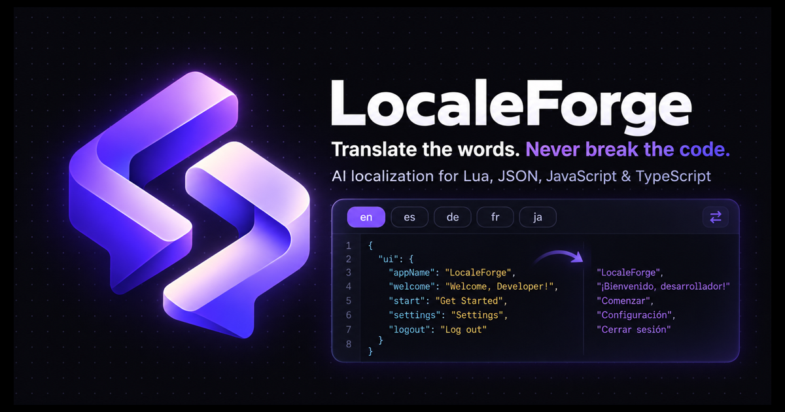

<div align="center">
  

  # LocaleForge

  **Translate the words. Never break the code.**

  AI-assisted localization for Lua, JSON, JavaScript, and TypeScript files—without accounts, dashboards, or damaged placeholders.

  [Live app](https://locale.hastherish.com) · [Open translator](https://locale.hastherish.com/translate) · [Report an issue](https://github.com/HastH8/LocaleForge/issues)

  
  
  
  
</div>



## Overview

LocaleForge is a focused localization workspace for developers. Upload or paste a localization file, choose as many as 12 target languages, review each generated file in a syntax-aware editor, and download one file or a complete ZIP archive.

The server asks Gemini to translate only human-readable strings. It instructs the model to preserve keys, nesting, delimiters, comments, quote style, and common runtime placeholders, then checks the returned result before presenting it to the user.

## Highlights

- **No account required** — open the translator and start immediately.
- **Developer-native formats** — Lua, JSON, JavaScript, and TypeScript.
- **Broad language catalog** — searchable target-language picker with native names and country flags.
- **Structure-aware prompts** — keys, identifiers, paths, commands, and framework names stay untouched.
- **Placeholder validation** — protects patterns including `%{name}`, `{{count}}`, `${value}`, `%s`, `%d`, `[E]`, `~r~`, and `^1`.
- **Syntax-aware review** — Monaco for editable source and translated files, plus Shiki-powered code presentation.
- **Batch translation** — up to 12 target languages per request, processed in small concurrent batches.
- **Flexible export** — download an individual translation or every result as a ZIP.
- **Light and dark themes** — system-aware with a manual toggle.
- **Privacy-minded architecture** — no user database and no saved translation history in the application.
- **Production discovery** — canonical URLs, Open Graph and X/Twitter cards, JSON-LD, robots.txt, sitemap.xml, a web manifest, and a custom 404 page.

## How it works

```text
Upload or paste → Choose languages → Translate → Validate → Review → Download
```

1. The browser sends the source file, format, source language, and selected target codes to `POST /api/translate`.
2. The server validates request size, target count, and supported language codes.
3. The Gemini Interactions API translates targets in batches of three with minimal thinking for lower latency.
4. LocaleForge strips accidental Markdown fences and compares placeholder and key counts.
5. The browser opens every result in an editable code view and enables individual or ZIP downloads.

## Supported files and limits

| Capability | Current limit |
| --- | --- |
| File formats | `.lua`, `.json`, `.js`, `.ts` |
| Target languages | 1–12 per run |
| Source length | 100,000 characters |
| Anonymous requests | 20 per IP per hour per warm server instance |
| Model request timeout | 35 seconds |
| Server route duration | 60 seconds |

The in-memory rate limiter is intentionally simple. For a high-traffic production service, replace it with a durable store such as Vercel KV, Upstash Redis, or another shared rate-limit backend.

## Tech stack

| Layer | Technology |
| --- | --- |
| Framework | Next.js 16 App Router, React 19, TypeScript |
| Styling | Tailwind CSS 4, shadcn/ui, Base UI |
| Motion and icons | Motion, Lucide React |
| Code editing | Monaco Editor |
| Highlighting | Shiki and Code Blocks components |
| Flags | `country-flag-icons` |
| Translation | Google Gen AI SDK and Gemini Interactions API |
| Analytics | Vercel Web Analytics, loaded after visitor consent |
| Archive export | JSZip |
| Deployment | Vercel |

## Local development

### Requirements

- Node.js 20.9 or newer
- npm 10 or newer
- A [Google AI Studio API key](https://aistudio.google.com/apikey)

### Setup

```bash
git clone https://github.com/HastH8/LocaleForge.git
cd LocaleForge
npm install
cp .env.example .env.local
```

Add your key to `.env.local`:

```bash
GEMINI_API_KEY=your_gemini_api_key
GEMINI_MODEL=gemini-3.1-flash-lite
```

Start the development server:

```bash
npm run dev
```

Open [http://localhost:3000](http://localhost:3000). The marketing page is at `/`, and the full translation workspace is at `/translate`.

### Environment variables

| Variable | Required | Purpose |
| --- | --- | --- |
| `GEMINI_API_KEY` | Yes | Server-only credential used by the translation route. |
| `GEMINI_MODEL` | No | Gemini model alias. Defaults to `gemini-3.1-flash-lite`. |
| `NEXT_PUBLIC_SITE_URL` | Recommended in production | Canonical site origin used by metadata, JSON-LD, robots, and the sitemap. |

Never prefix the Gemini key with `NEXT_PUBLIC_`. LocaleForge reads it only inside the server route, and `.env*` files are ignored by Git.

## Available scripts

```bash
npm run dev        # Start the development server
npm run build      # Create a production build
npm run start      # Serve the production build
npm run lint       # Run ESLint
npm run typecheck  # Run TypeScript without emitting files
npm run format     # Format TypeScript and TSX files with Prettier
```

Before opening a pull request or deploying, run:

```bash
npm run typecheck
npm run lint
npm run build
```

## API reference

### `POST /api/translate`

Request body:

```json
{
  "source": "{\"welcome\": \"Welcome, %{name}!\"}",
  "sourceLanguage": "English",
  "targets": ["fr-FR", "de"],
  "fileName": "locales.json",
  "format": "json"
}
```

Successful response:

```json
{
  "results": [
    {
      "code": "fr-FR",
      "name": "French (France)",
      "nativeName": "Français",
      "flag": "🇫🇷",
      "content": "{\"welcome\": \"Bienvenue, %{name} !\"}",
      "validation": {
        "placeholderSafe": true,
        "keyCount": 1,
        "keyCountMatches": true
      }
    }
  ],
  "model": "gemini-3.1-flash-lite"
}
```

Errors use a JSON body with a human-readable `error` property and an appropriate HTTP status. Common cases include invalid input (`400`), rate limiting (`429`), oversized input (`413`), missing configuration (`503`), and upstream translation failure (`502`).

## Project structure

```text
app/
├── api/translate/route.ts   # Validated Gemini translation endpoint
├── translate/               # Full translator workspace route
├── privacy/ terms/ cookies/ # Legal pages
├── layout.tsx               # Site-wide metadata and structured data
├── manifest.ts              # Installable web-app metadata
├── robots.ts                # Crawler rules
├── sitemap.ts               # Search-engine URL inventory
└── not-found.tsx            # Branded 404 experience
components/
├── code-block/              # Shiki-backed code presentation
├── ui/                      # Reusable shadcn/ui components
├── landing-page.tsx         # Marketing experience
└── translator-page.tsx      # Client translation workflow
lib/
├── languages.ts             # Supported language catalog
└── site.ts                  # Canonical site configuration
public/
└── localeforge-mark.png     # Product mark
```

## Deploying to Vercel

1. Import the GitHub repository into Vercel.
2. Keep the detected framework preset as **Next.js**.
3. Add `GEMINI_API_KEY` as a Production, Preview, and Development environment variable.
4. Optionally add `GEMINI_MODEL=gemini-3.1-flash-lite`.
5. Set `NEXT_PUBLIC_SITE_URL` to the production origin, such as `https://localeforge.vercel.app`.
6. Deploy.

To use a custom domain, open **Project Settings → Domains** in Vercel, add the domain, follow the displayed DNS instructions, update `NEXT_PUBLIC_SITE_URL` to the final `https://` origin, and redeploy so canonical and social metadata use it.

## SEO and social sharing

LocaleForge ships with:

- Descriptive, templated page titles and meta descriptions
- Canonical URLs for public routes
- Open Graph and X/Twitter large-image cards
- A generated 1200×630 social preview image
- `WebApplication` JSON-LD structured data
- `/robots.txt`, `/sitemap.xml`, and `/manifest.webmanifest`
- Semantic heading structure and a custom 404 page

After connecting a custom domain, submit `/sitemap.xml` in Google Search Console and Bing Webmaster Tools. Social crawlers may cache old cards, so use each platform’s sharing debugger after a metadata change.

## Privacy and security notes

- LocaleForge does not require an account or maintain a translation-history database.
- Vercel Web Analytics loads only after a visitor chooses **Accept all** in the cookie notice.
- Source files and generated text pass through the application server and the configured Gemini API to complete a request.
- The application requests `store: false` from the Gemini Interactions API.
- Do not submit credentials, secrets, regulated personal data, or source code you are not authorized to process.
- Generated translations can be wrong even when validation passes. Review and test them before release.
- The repository intentionally excludes environment files and Vercel project metadata.

For public deployment, configure spending and quota controls in Google AI Studio, keep dependencies updated, and use a durable distributed rate limiter if traffic grows.

## Troubleshooting

### “The configured translation model is unavailable”

Set `GEMINI_MODEL=gemini-3.1-flash-lite`, restart the local server, or redeploy after updating the Vercel environment variable.

### Translation stays in progress and then times out

Try fewer target languages or a smaller file. The API processes up to three translations concurrently and gives each Gemini request 35 seconds.

### Gemini reports quota or high demand

Free-tier capacity can be temporary. Wait, retry, or review the API key’s model access and quota in Google AI Studio.

### Metadata still shows the Vercel URL after adding a domain

Update `NEXT_PUBLIC_SITE_URL` to the custom origin and trigger a fresh production deployment.

## Contributing

Issues and focused pull requests are welcome. Please describe the user-facing problem, keep changes scoped, and include verification notes or screenshots for interface work.

1. Fork the repository and create a feature branch.
2. Make the change and add relevant tests or validation steps.
3. Run type checking, linting, and a production build.
4. Open a pull request with a clear summary.

## License

LocaleForge is available under the [MIT License](LICENSE).

---

<div align="center">
  Built for developers who want localization to feel like part of the codebase—not a separate enterprise workflow.
</div>
